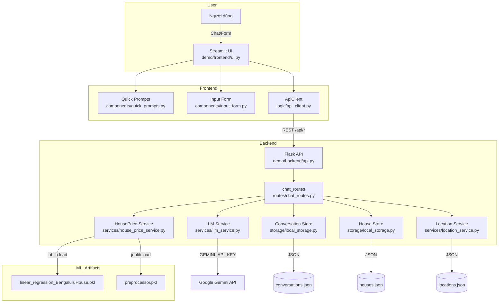

# Bengaluru House Price Prediction Chatbot

Ứng dụng demo dự đoán giá nhà tại Bengaluru với giao diện chatbot. Frontend dùng Streamlit, backend dùng Flask, có thể kết nối Gemini. Khi đủ thông tin (location, total_sqft, bath, bhk) backend gọi mô hình tuyến tính đã huấn luyện để trả về giá dự đoán (đơn vị lakh) và lưu lịch sử/record vào file JSON cục bộ.

## Kiến trúc & mã nguồn chính (gọn)

| Thành phần | Vai trò |
| --- | --- |
| `demo/app.py` | Khởi động song song Flask API (port 10000) và Streamlit UI (port 10001, tự dời nếu trùng); đọc `API_HOST`/`API_PORT`/`UI_HOST`/`UI_PORT`/`STREAMLIT_PORT`, đặt `FRONTEND_URL` cho redirect. |
| `demo/backend/api.py` | Tạo Flask app, bật CORS, load `.env` (gốc, `demo/.env`, `demo/backend/.env`), redirect về `FRONTEND_URL` nếu có. |
| `demo/backend/routes/chat_routes.py` | Endpoint: `POST /api/chat`, `GET /api/chat/<session_id>`, `POST /api/house/predict`, `GET /health`, `/api/locations`; trích trường, dò location theo `storage/locations.json` (cả substring), gọi LLM, gọi mô hình dự đoán, lưu lịch sử/bản ghi. |
| `demo/backend/services/llm_service.py` | Gọi Gemini theo biến `GEMINI_*`; nếu thiếu API key sẽ trả lời giả lập để dev test. |
| `demo/backend/services/house_price_service.py` | Nạp `models/linear_regression_BengaluruHouse.pkl` và `models/preprocessor.pkl`, biến đổi input, trả giá dự đoán. |
| `demo/backend/storage/local_storage.py` | Lưu lịch sử chat và record dự đoán ra JSON; hỗ trợ lưu từng phần record theo `session_id`, cập nhật dần đến khi đủ trường. |
| `demo/frontend/ui.py` | Giao diện chat Streamlit (quick prompts, form thu gọn, avatar); nhập `API_BASE_URL`; đồng bộ lịch sử theo `session_id`; dropdown location lấy động từ `/api/locations`. |
| `demo/frontend/components/quick_prompts.py` | Thẻ gợi ý hội thoại mẫu. |
| `demo/frontend/components/input_form.py` | Form nhập location/total_sqft/BHK/bath và đẩy vào chat. |
| `demo/frontend/logic/api_client.py` | Client REST gọi `POST /api/chat` và `GET /api/chat/<session_id>`. |
| `demo/frontend/styles/` | CSS tùy chỉnh cho Streamlit (bỏ qua `index.html` demo tĩnh). |
| `src/preprocessing.py`, `src/modeling.py`, `src/predict.py` | Xử lý dữ liệu (khớp notebook, sau làm sạch còn 7 251 dòng), huấn luyện, hàm dự đoán dùng chung cho backend. |
| `models/` | Chứa model và preprocessor đã huấn luyện. |

## Sơ đồ kiến trúc (Mermaid)



## Thiết lập môi trường

Yêu cầu Python 3.8+ và `pip`.

```bash
# 1. Tạo môi trường ảo (.venv)
python -m venv .venv

# 2. Kích hoạt môi trường ảo (Windows)
.venv\Scripts\activate
# 2. Kích hoạt môi trường ảo (macOS/Linux)
# source .venv/bin/activate

# 3. Cài đặt các thư viện phụ thuộc
pip install -r requirements.txt
```

### Biến môi trường quan trọng

Sao chép và chỉnh `.env` ở thư mục gốc:

- `GEMINI_API_KEY`: Key Google Gemini (tùy chọn; nếu bỏ trống sẽ dùng phản hồi giả lập).
- `GEMINI_MODEL_NAME`, `GEMINI_TEMPERATURE`, `GEMINI_MAX_TOKENS`: Tinh chỉnh model LLM.
- `API_BASE_URL`: URL backend cho frontend Streamlit (ví dụ `http://localhost:10000/api` khi chạy cùng `demo/app.py`).
- `API_HOST`, `API_PORT`, `UI_HOST`, `UI_PORT`/`STREAMLIT_PORT`, `FRONTEND_URL`: Cấu hình host/port và URL public khi deploy.

## Chạy ứng dụng

### Cách đơn giản (chạy cả backend + frontend)

```bash
python demo/app.py
```

- Backend Flask: `http://localhost:10000/api`
- Frontend Streamlit: `http://localhost:10001` (tự dời nếu trùng cổng)

### Chạy tách biệt

```bash
# Cửa sổ 1: Backend
python demo/backend/api.py  # hoặc FLASK_ENV/PORT qua biến môi trường

# Cửa sổ 2: Frontend (trỏ đúng API_BASE_URL)
streamlit run demo/frontend/ui.py
```

Mở trình duyệt tại URL Streamlit để dùng chatbot.

## Ghi chú triển khai

- Lịch sử chat và record dự đoán được lưu JSON cục bộ trong `demo/backend/storage/`; khi deploy thực tế nên thay bằng DB/bucket.
- Nếu dùng Render hoặc host khác, đặt `FRONTEND_URL` và `API_BASE_URL` phù hợp để frontend/backend nhận đúng URL public.
- LLM cần Gemini API key; nếu không có, luồng chat vẫn hoạt động nhưng trả lời mang tính minh họa, dự đoán giá vẫn chạy nếu đủ trường và có model.
